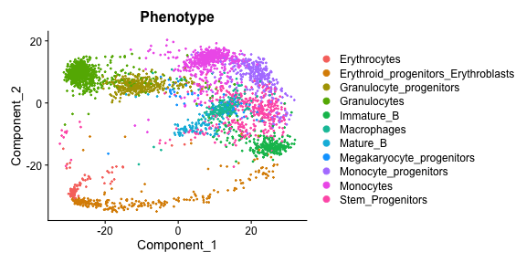
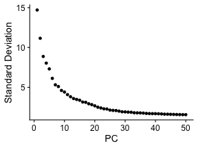
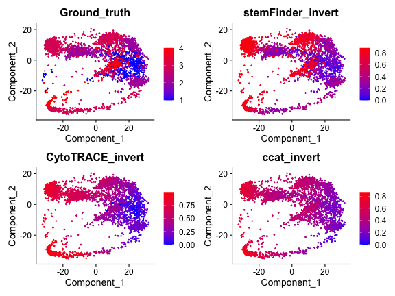

## Setup

```r
#install.packages("devtools")
library(devtools)
#devtools::install_github("pcahan1/stemfinder")
library(stemFinder, verbose = F)
```

## Load example data - Mouse BMMC 10X dataset

#### Query data must have two metadata columns: Phenotype (string of cell type annotations) and Ground_truth (numeric, ascending ground truth potency values)
###### Note: example data has already been filtered, normalized, and scaled

[Query data: Murine bone marrow, 10X platform, available on S3](https://cnobjects.s3.amazonaws.com/stemFinder/MurineBoneMarrow10X_GSE109774.rds)


```r
adata = readRDS("MurineBoneMarrow10X_GSE109774.rds")
head(adata,2)
```

```
##                            orig.ident nCount_RNA nFeature_RNA            Phenotype
## X10X_P7_3_AAACCTGAGCATCATC       X10X      12994         3468 Monocyte_progenitors
## X10X_P7_3_AAACCTGCAGAGTGTG       X10X       5437         1764            Monocytes
##                            Ground_truth percent.mt percent.ribo    S.Score  G2M.Score Phase
## X10X_P7_3_AAACCTGAGCATCATC            2          0     22.62583  0.3360127  0.3821197   G2M
## X10X_P7_3_AAACCTGCAGAGTGTG            3          0     24.03899 -0.1894597 -0.3641231    G1
```



## Run stemFinder


```r
#PCA
adata <- RunPCA(adata, verbose = F)
```




```r
#Select PCs based on elbow plot
pcs = 32

#Perform K nearest neighbors
k = round(sqrt(ncol(adata))) #default value of k parameter
adata = FindNeighbors(adata, dims = 1:pcs, k.param = k, verbose = F)
knn = adata@graphs$RNA_nn #KNN matrix

#Select input marker gene list
cell_cycle_genes = c(s_genes_mouse, g2m_genes_mouse)[c(s_genes_mouse, g2m_genes_mouse) %in% rownames(adata)] #default G2M + S cell cycle gene list

#Compute single-cell potency
adata = run_stemFinder(adata, k = k, nn = knn, thresh = 0, markers = cell_cycle_genes)
head(adata) 
```

```
##                            orig.ident nCount_RNA nFeature_RNA               Phenotype
## X10X_P7_3_AAACCTGAGCATCATC       X10X      12994         3468    Monocyte_progenitors
## X10X_P7_3_AAACCTGCAGAGTGTG       X10X       5437         1764               Monocytes
## X10X_P7_3_AAACCTGGTCGAACAG       X10X       4466         1526    Monocyte_progenitors
## X10X_P7_3_AAACCTGTCACTTCAT       X10X      23852         4043        Stem_Progenitors
## X10X_P7_3_AAACGGGAGAAGGTTT       X10X       4375          977            Granulocytes
## X10X_P7_3_AAACGGGAGTAGTGCG       X10X       5451         1644               Monocytes
## X10X_P7_3_AAACGGGCACGACTCG       X10X      30906         3836 Granulocyte_progenitors
## X10X_P7_3_AAACGGGGTAGCACGA       X10X       6076         1940               Monocytes
## X10X_P7_3_AAAGATGCACTCGACG       X10X       8027         2981              Immature_B
## X10X_P7_3_AAAGATGCATGGATGG       X10X       6458         1487 Granulocyte_progenitors
##                            Ground_truth percent.mt percent.ribo     S.Score  G2M.Score Phase
## X10X_P7_3_AAACCTGAGCATCATC            2          0    22.625827  0.33601275  0.3821197   G2M
## X10X_P7_3_AAACCTGCAGAGTGTG            3          0    24.038992 -0.18945969 -0.3641231    G1
## X10X_P7_3_AAACCTGGTCGAACAG            2          0    33.631885  0.30172632 -0.1413534     S
## X10X_P7_3_AAACCTGTCACTTCAT            1          0    33.104142 -0.01163238 -0.3062905    G1
## X10X_P7_3_AAACGGGAGAAGGTTT            3          0     2.537143 -0.15402552 -0.1239491    G1
## X10X_P7_3_AAACGGGAGTAGTGCG            3          0    30.544854 -0.21395371 -0.3532216    G1
## X10X_P7_3_AAACGGGCACGACTCG            2          0    12.738627  0.02354409  0.4392959   G2M
## X10X_P7_3_AAACGGGGTAGCACGA            3          0    22.728769 -0.22305128 -0.3560751    G1
## X10X_P7_3_AAAGATGCACTCGACG            2          0    11.847515  0.44817941  0.9243623   G2M
## X10X_P7_3_AAAGATGCATGGATGG            2          0     7.742335  0.27757475  0.1743533     S
##                            stemFinder stemFinder_invert stemFinder_comp
## X10X_P7_3_AAACCTGAGCATCATC  17.450357         0.1417314      0.18967779
## X10X_P7_3_AAACCTGCAGAGTGTG   5.141795         0.7471088      0.05588908
## X10X_P7_3_AAACCTGGTCGAACAG  15.401308         0.2425106      0.16740552
## X10X_P7_3_AAACCTGTCACTTCAT  18.712842         0.0796380      0.20340045
## X10X_P7_3_AAACGGGAGAAGGTTT   2.988407         0.8530199      0.03248268
## X10X_P7_3_AAACGGGAGTAGTGCG   3.719679         0.8170534      0.04043129
## X10X_P7_3_AAACGGGCACGACTCG  15.128716         0.2559177      0.16444256
## X10X_P7_3_AAACGGGGTAGCACGA   4.770214         0.7653844      0.05185015
## X10X_P7_3_AAAGATGCACTCGACG  13.028835         0.3591970      0.14161777
## X10X_P7_3_AAAGATGCATGGATGG  17.371581         0.1456058      0.18882154
```

### The following 3 columns are added to metadata: 
#### -Raw potency score ("stemFinder")
#### -Inverted potency score to correspond with pseudotime / ground truth ("stemFinder_invert")
#### -Comparable potency score across datasets ("stemFinder_comp")

[Check against previously-computed stemFinder results on this dataset](https://cnobjects.s3.amazonaws.com/stemFinder/bmmc_sF_results.csv)

```r
sF_scores = read.csv("bmmc_sF_results.csv", row.names = 1)
head(sF_scores)
```

```
##                            stemFinder stemFinder_invert stemFinder_comp
## X10X_P7_3_AAACCTGAGCATCATC  17.193335        0.15611517      0.18688408
## X10X_P7_3_AAACCTGCAGAGTGTG   5.174950        0.74600265      0.05624945
## X10X_P7_3_AAACCTGGTCGAACAG  15.202528        0.25382815      0.16524487
## X10X_P7_3_AAACCTGTCACTTCAT  18.691755        0.08256958      0.20317125
## X10X_P7_3_AAACGGGAGAAGGTTT   3.007756        0.85237303      0.03269300
## X10X_P7_3_AAACGGGAGTAGTGCG   3.617926        0.82242464      0.03932528
```
      
## Quantify stemFinder performance


```r
# Compute stemFinder performance metrics
list_all = compute_performance_single(adata, competitor = F)
```

```
## [1] "Single-cell Spearman Correlation, stemFinder: 0.74"
## [1] "AUC, stemFinder: 0.97"
## [1] "Phenotypic Spearman correlation, stemFinder: 0.89"
```

```r
pct.recov = pct_recover(adata)
```

```
## [1] "Percentage highly potent cells recovered by stemFinder: 82.9573934837093"
## [1] "Relative abundance of highly potent cells: 11.6428362999708"
```

## Optional: compare stemFinder performance to another method

[CytoTRACE and CCAT-computed potency scores](https://cnobjects.s3.amazonaws.com/stemFinder/bmmc_competitor_results.csv)

```r
#Load pre-computed competitor potency scores
comp_scores = read.csv("bmmc_competitor_results.csv", row.names = 1)
head(comp_scores,2)
```

```
##                            CytoTRACE      ccat CytoTRACE_invert ccat_invert
## X10X_P7_3_AAACCTGAGCATCATC      2645 0.3818031        0.2281879   0.2388558
## X10X_P7_3_AAACCTGCAGAGTGTG      1520 0.2712764        0.5564634   0.4591965
```

```r
adata@meta.data = cbind(adata@meta.data, comp_scores) #add to metadata

#Quantify performance
list_all_withcomp = compute_performance_single(adata, competitor = T, comp_id = 'CytoTRACE') 
```

```
## [1] "Single-cell Spearman Correlation, stemFinder: 0.74"
## [1] "AUC, stemFinder: 0.97"
## [1] "Phenotypic Spearman correlation, stemFinder: 0.89"
```

```r
print(list_all_withcomp)
```

```
## $`stemFinder results`
## Spearman_SingleCell      Spearman_Pheno                 AUC 
##           0.7362904           0.8866655           0.9698956 
## 
## $`Competitor results`
## Spearman_SingleCell      Spearman_Pheno                 AUC 
##           0.5712992           0.6307109           0.8847005
```

## Visualize single-cell potency scores 

##### UMAP embedding


##### Box plot of stemFinder score

