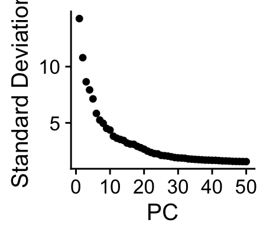
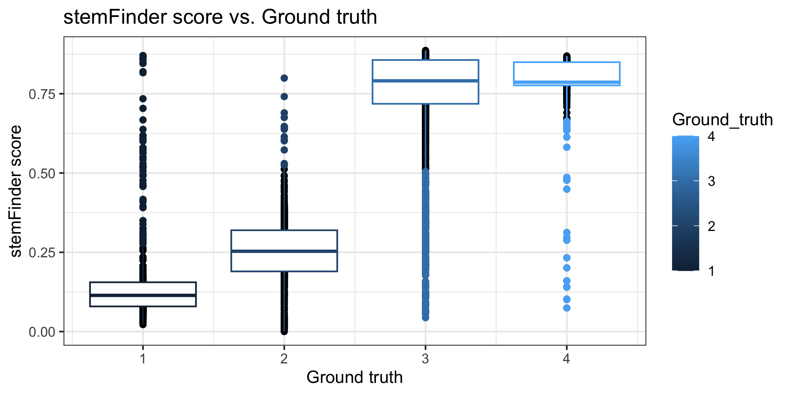

stemFinder vignette
================
Kathleen Noller
07/11/2024

# stemFinder

### Single-cell estimation of differentiation time from scRNA-seq data

# 

# 

## Setup

``` r
options(repos = c(CRAN = "https://cloud.r-project.org"))
install.packages("devtools")
```

    ## 
    ## The downloaded binary packages are in
    ##  /var/folders/hb/b7nzqfss2_l63s3qz23cqftr0000gp/T//Rtmpa5pZ4q/downloaded_packages

``` r
devtools::install_github("cahanlab/stemfinder")
```

    ## Skipping install of 'stemFinder' from a github remote, the SHA1 (83a451f7) has not changed since last install.
    ##   Use `force = TRUE` to force installation

``` r
library(stemFinder)
```

    ## Loading required package: dplyr

    ## 
    ## Attaching package: 'dplyr'

    ## The following objects are masked from 'package:stats':
    ## 
    ##     filter, lag

    ## The following objects are masked from 'package:base':
    ## 
    ##     intersect, setdiff, setequal, union

    ## Loading required package: MASS

    ## 
    ## Attaching package: 'MASS'

    ## The following object is masked from 'package:dplyr':
    ## 
    ##     select

    ## Loading required package: Seurat

    ## Attaching SeuratObject

    ## Loading required package: ggplot2

## Load query data - Bone marrow from Tabula Muris

#### Query data should be a Seurat object containing a log-normalized, scaled single-cell gene expression matrix

#### Query data must have two metadata columns:

##### Phenotype (character vector of cell type annotations) and Ground_truth (numeric vector of ascending ground truth values denoting extent of differentiation)

###### Note: example data has already been filtered, normalized, and scaled

[Download query data: Tabula Muris bone marrow, 10X
platform](https://cnobjects.s3.amazonaws.com/stemFinder/MurineBoneMarrow10X_GSE109774.rds)

``` r
adata = readRDS("MurineBoneMarrow10X_GSE109774.rds")
head(adata,2)
```

    ##                            orig.ident nCount_RNA nFeature_RNA
    ## X10X_P7_3_AAACCTGAGCATCATC       X10X      12994         3468
    ## X10X_P7_3_AAACCTGCAGAGTGTG       X10X       5437         1764
    ##                                       Phenotype Ground_truth percent.mt
    ## X10X_P7_3_AAACCTGAGCATCATC Monocyte_progenitors            2          0
    ## X10X_P7_3_AAACCTGCAGAGTGTG            Monocytes            3          0
    ##                            percent.ribo    S.Score  G2M.Score Phase
    ## X10X_P7_3_AAACCTGAGCATCATC     22.62583  0.3360127  0.3821197   G2M
    ## X10X_P7_3_AAACCTGCAGAGTGTG     24.03899 -0.1894597 -0.3641231    G1


## Prepare inputs to stemFinder

``` r
# Select input cell cycle gene list
      ## standard input to stemFinder: G2M and S cell cycle genes
      ## G2M and S gene lists are provided for mouse, human, and C. elegans
cell_cycle_genes = c(s_genes_mouse, g2m_genes_mouse)[c(s_genes_mouse, g2m_genes_mouse) %in% rownames(adata)] 
VariableFeatures(adata) = VariableFeatures(adata)[!(VariableFeatures(adata) %in% cell_cycle_genes)] #make sure cell cycle genes are not among highly variable features

# PCA
adata <- RunPCA(adata, verbose = F)
p1 <- ElbowPlot(adata, ndims = 50)
```



``` r
#Select PCs based on elbow plot
pcs = 32

#Perform K nearest neighbors
k = round(sqrt(ncol(adata))) #default value of k parameter
adata = FindNeighbors(adata, dims = 1:pcs, k.param = k, verbose = F)
knn = adata@graphs$RNA_nn #KNN matrix
```

## Run stemFinder

#### Inputs:

##### adata: Seurat object containing log-normalized, scaled gene expression data (features x cells)

##### k: number of nearest neighbors

##### nn: KNN matrix (cells x cells)

##### thresh: threshold for binarizing gene expression data (default = 0)

##### markers: character vector of cell cycle genes present in query data

##### method: string denoting which method of computing gene expression heterogeneity to use (default: ‘gini’, other: ‘stdev’ and ‘variance’)

``` r
adata = run_stemFinder(adata, k = k, nn = knn, thresh = 0, markers = cell_cycle_genes, method = 'gini')

head(adata,5) 
```

    ##                            orig.ident nCount_RNA nFeature_RNA
    ## X10X_P7_3_AAACCTGAGCATCATC       X10X      12994         3468
    ## X10X_P7_3_AAACCTGCAGAGTGTG       X10X       5437         1764
    ## X10X_P7_3_AAACCTGGTCGAACAG       X10X       4466         1526
    ## X10X_P7_3_AAACCTGTCACTTCAT       X10X      23852         4043
    ## X10X_P7_3_AAACGGGAGAAGGTTT       X10X       4375          977
    ##                                       Phenotype Ground_truth percent.mt
    ## X10X_P7_3_AAACCTGAGCATCATC Monocyte_progenitors            2          0
    ## X10X_P7_3_AAACCTGCAGAGTGTG            Monocytes            3          0
    ## X10X_P7_3_AAACCTGGTCGAACAG Monocyte_progenitors            2          0
    ## X10X_P7_3_AAACCTGTCACTTCAT     Stem_Progenitors            1          0
    ## X10X_P7_3_AAACGGGAGAAGGTTT         Granulocytes            3          0
    ##                            percent.ribo     S.Score  G2M.Score Phase
    ## X10X_P7_3_AAACCTGAGCATCATC    22.625827  0.33601275  0.3821197   G2M
    ## X10X_P7_3_AAACCTGCAGAGTGTG    24.038992 -0.18945969 -0.3641231    G1
    ## X10X_P7_3_AAACCTGGTCGAACAG    33.631885  0.30172632 -0.1413534     S
    ## X10X_P7_3_AAACCTGTCACTTCAT    33.104142 -0.01163238 -0.3062905    G1
    ## X10X_P7_3_AAACGGGAGAAGGTTT     2.537143 -0.15402552 -0.1239491    G1
    ##                            stemFinder_raw stemFinder
    ## X10X_P7_3_AAACCTGAGCATCATC      18.654875 0.08664202
    ## X10X_P7_3_AAACCTGCAGAGTGTG       5.315398 0.73975374
    ## X10X_P7_3_AAACCTGGTCGAACAG      16.387931 0.19763346
    ## X10X_P7_3_AAACCTGTCACTTCAT      19.251784 0.05741689
    ## X10X_P7_3_AAACGGGAGAAGGTTT       2.994946 0.85336496

### The following 2 columns are added to metadata:

##### -Raw stemFinder score (“stemFinder_raw”)

##### -stemFinder score with directionality corresponding to pseudotime / ground truth (“stemFinder”)

[Check against previously-computed stemFinder results on this
dataset](https://cnobjects.s3.amazonaws.com/stemFinder/bmmc_sF_results.csv)

``` r
sF_scores = read.csv("bmmc_sF_results.csv", row.names = 1)
head(sF_scores,5)
```

    ##                            stemFinder_raw stemFinder
    ## X10X_P7_3_AAACCTGAGCATCATC      18.654875 0.08664202
    ## X10X_P7_3_AAACCTGCAGAGTGTG       5.315398 0.73975374
    ## X10X_P7_3_AAACCTGGTCGAACAG      16.387931 0.19763346
    ## X10X_P7_3_AAACCTGTCACTTCAT      19.251784 0.05741689
    ## X10X_P7_3_AAACGGGAGAAGGTTT       2.994946 0.85336496

## Quantify stemFinder performance relative to ground truth

``` r
# Compute stemFinder performance metrics
list_all = compute_performance_single(adata, competitor = F)
```

    ## [1] "Single-cell Spearman Correlation, stemFinder: 0.74"
    ## [1] "AUC, stemFinder: 0.97"
    ## [1] "Phenotypic Spearman correlation, stemFinder: 0.89"

``` r
pct.recov = pct_recover(adata)
```

    ## [1] "Percentage of cells with low degree of differentiation recovered by stemFinder: 84.7117794486216"
    ## [1] "Relative abundance of cells with low degree of differentiation: 11.6428362999708"

## Optional: compare stemFinder performance to another method

[CytoTRACE and CCAT scores for BMMC query
data](https://cnobjects.s3.amazonaws.com/stemFinder/bmmc_competitor_results.csv)

``` r
#Load pre-computed competitor scores 
comp_scores = read.csv("bmmc_competitor_results.csv", row.names = 1)
head(comp_scores,2)
```

    ##                            CytoTRACE      ccat CytoTRACE_invert ccat_invert
    ## X10X_P7_3_AAACCTGAGCATCATC      2645 0.3818031        0.2281879   0.2388558
    ## X10X_P7_3_AAACCTGCAGAGTGTG      1520 0.2712764        0.5564634   0.4591965

``` r
adata@meta.data = cbind(adata@meta.data, comp_scores) #add to metadata
adata$competitor = adata$ccat_invert #rename desired competitor column 

#Quantify performance
list_all_withcomp = compute_performance_single(adata, competitor = T, comp.inverted = T)
```

    ## [1] "Single-cell Spearman Correlation, stemFinder: 0.74"
    ## [1] "AUC, stemFinder: 0.97"
    ## [1] "Phenotypic Spearman correlation, stemFinder: 0.89"

``` r
print(list_all_withcomp)
```

    ## $`stemFinder results`
    ## Spearman_SingleCell      Spearman_Pheno                 AUC 
    ##           0.7428144           0.8883756           0.9724200 
    ## 
    ## $`Competitor results`
    ## Spearman_SingleCell      Spearman_Pheno                 AUC 
    ##           0.6755672           0.7783368           0.9298890

## Visualize stemFinder and competitor results

##### Feature plot

``` r
p2 <- FeaturePlot(adata, features = c('Ground_truth','stemFinder','competitor'), cols = c('blue','red'), ncol = 3)
```


##### Box plot

``` r
p3 <- ggplot(adata@meta.data, aes(x = Ground_truth, y = stemFinder)) + geom_point() + geom_boxplot(aes(group = Ground_truth, color = Ground_truth)) + theme_bw() + ggtitle("stemFinder score vs. Ground truth") + ylab("stemFinder score") + xlab("Ground truth")
```


